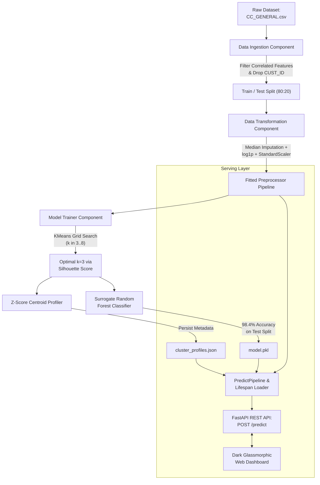

# 💳 SegmentIQ — Credit Card Customer Segmentation Engine

[](https://www.python.org/)
[](https://fastapi.tiangolo.com/)
[](https://scikit-learn.org/)
[](https://docs.pydantic.dev/)
[](LICENSE)

An end-to-end, production-grade Machine Learning system that transforms raw credit card transactional activity into distinct, actionable customer personas. 

Powered by unsupervised **KMeans clustering** with automated silhouette optimization, a **Random Forest surrogate classifier** for sub-millisecond serving, a **FastAPI** REST backend, and a luxury dark-mode **glassmorphic web dashboard** with real-time visual analytics.

---

## 📌 Table of Contents
- [Executive Summary & Business Value](#-executive-summary--business-value)
- [System Architecture](#-system-architecture)
- [Behavioral Personas Discovered](#-behavioral-personas-discovered)
- [Machine Learning Workflow](#-machine-learning-workflow)
  - [1. Data Ingestion & Multicollinearity Pruning](#1-data-ingestion--multicollinearity-pruning)
  - [2. Preprocessing & Selective Log1p Transformation](#2-preprocessing--selective-log1p-transformation)
  - [3. Optimal Clustering & Silhouette Scoring](#3-optimal-clustering--silhouette-scoring)
  - [4. Automated Behavioral Profiling](#4-automated-behavioral-profiling)
  - [5. Fast-Inference Supervised Classifier](#5-fast-inference-supervised-classifier)
- [Web Application & Visual Analytics](#-web-application--visual-analytics)
- [Project Directory Structure](#-project-directory-structure)
- [Getting Started & Installation](#-getting-started--installation)
- [Running the Pipelines](#-running-the-pipelines)
  - [1. Retraining the Offline Model Pipeline](#1-retraining-the-offline-model-pipeline)
  - [2. Launching the FastAPI Web Service](#2-launching-the-fastapi-web-service)
- [API Reference](#-api-reference)
- [Tech Stack](#-tech-stack)

---

## 🎯 Executive Summary & Business Value

Banks and financial institutions often struggle to effectively differentiate credit card cardholders from raw balance and transactional tables alone. Treating all cardholders with blanket marketing campaigns leads to churn, sub-optimal credit limit allocations, and heightened default risk.

**SegmentIQ** solves this problem by:
- Identifying spending vs. cash-withdrawal behavioral boundaries across customer accounts.
- Tailoring banking actions per persona (e.g., offering premium reward tiers to high-spenders vs. liquidity monitoring for cash-advance heavy users).
- Delivering sub-millisecond, low-latency scoring via a surrogate classifier trained on cluster centroids.

---

## 🏛 System Architecture



---

## 👥 Behavioral Personas Discovered

Using standardized z-score deviation thresholds ($\pm 0.5\sigma$) from population means, the clustering engine segmented customers into 3 core personas:

| Segment | Persona Title | Primary Behavioral Characteristics | Actionable Banking Strategy |
| :---: | :--- | :--- | :--- |
| **0** | **Frequent Cash-Advance Users** | High cash withdrawals (`CASH_ADVANCE` z: +0.87), low retail purchases (`PURCHASES_TRX` z: -0.96), low full-payment percentage. | **Risk & Liquidity Monitoring**: Offer installment transfer options, monitor credit risk, and assess liquidity stress. |
| **1** | **High Spenders** | Substantial one-off purchases (`ONEOFF_PURCHASES` z: +0.88), high installment frequency, high overall spend velocity. | **Premium Upsell & Rewards**: Upgrade to premium tier cards, increase credit limits, and offer targeted luxury reward perks. |
| **2** | **Low Activity / Dormant** | Low balance (`BALANCE` z: -1.19), minimal transaction frequency, prompt and disciplined payment ratio when active. | **Reactivation Campaigns**: Target with 0% introductory APR on new purchases, seasonal cashback, and re-engagement incentives. |

---

## 🔬 Machine Learning Workflow

### 1. Data Ingestion & Multicollinearity Pruning
* **Source Dataset**: Kaggle Credit Card Dataset (8,950 accounts, 18 features).
* **Identifier Stripping**: Dropped `CUST_ID` to prevent leakage.
* **Correlation Filtering**: Features with pairwise Pearson correlation $> 0.8$ (`PURCHASES`, `PURCHASES_INSTALLMENTS_FREQUENCY`, `CASH_ADVANCE_TRX`) were removed to avoid inflating Euclidean distances in KMeans.
* **Train/Test Holdout**: An 80/20 train/test split is performed upfront to evaluate the downstream classifier on unseen data.

### 2. Preprocessing & Selective Log1p Transformation
A unified Scikit-Learn `Pipeline` guarantees deterministic transformations:
```python
Pipeline(steps=[
    ("imputer", SimpleImputer(strategy="median")),
    ("log_transform", FunctionTransformer(self._log_transform_subset, validate=False)),
    ("scaler", StandardScaler()),
])
```
* **Median Imputation**: Null values in `MINIMUM_PAYMENTS` and `CREDIT_LIMIT` are imputed using training medians.
* **Selective `np.log1p`**: Bounded frequency columns (e.g. $[0, 1]$) are preserved as linear, while heavily right-skewed monetary amounts (`skew > 1`) undergo log transformation to stabilize variance.
* **StandardScaler**: Scales all attributes to zero mean and unit variance.
* **Zero Leakage**: The preprocessor is fit *strictly* on training data and serialized to `artifacts/models/preprocessor.pkl`.

### 3. Optimal Clustering & Silhouette Scoring
Candidate $k \in [3, 8]$ clusters are evaluated using `silhouette_score` alongside `davies_bouldin_score`:
* $k = 3$ produced the highest cluster separation and clear business interpretability.
* Saved to `artifacts/models/cluster_model.pkl`.

### 4. Automated Behavioral Profiling
Instead of manual heuristics, `model_trainer.py` calculates centroid z-scores across all features. Descriptors (`high spenders`, `frequent cash-advance users`, `low activity / dormant`) are generated dynamically and saved to `artifacts/models/cluster_profiles.json`.

### 5. Fast-Inference Supervised Classifier
* **The Production Optimization**: Calculating Euclidean distance to cluster centroids across multidimensional space at runtime introduces unnecessary latency.
* **Surrogate Classifier**: A `RandomForestClassifier` (200 estimators) is trained using the KMeans cluster assignments as target labels.
* **Accuracy**: Achieves **98.4% agreement** on held-out test data while executing single-sample predictions in **under 5 milliseconds**.

---

## 💻 Web Application & Visual Analytics

The web frontend is designed with a luxury dark glassmorphic aesthetic (`#05070e` / `#080c1a` with ambient neon blue glows):

1. **Interactive Segmentation Studio**:
   - **One-Click Presets**: Quickly load archetypes (*High Spender VIP*, *Cash Advance Heavy*, *Dormant*, *Balanced Cardholder*).
   - **Multi-Currency Engine**: Dropdown selector supporting **USD ($)**, **EUR (€)**, **GBP (£)**, **INR (₹)**, **CAD ($)**, **AUD ($)**, and **JPY (¥)** with live input conversion and transparent USD normalization for the model.
   - **Zero-Reset Button**: Instantly clears all fields to 0 and re-runs segmentation.
   - **Strict Input Validations**: Unrestricted decimal steps for frequencies ($[0.0, 1.0]$) and monetary values, with guarded tenure constraints.
2. **Dynamic Chart.js Visualizations**:
   - **Behavioral Radar Chart**: Plots the customer's normalized z-score footprint directly against the segment's centroid benchmark across 6 dimensions.
   - **Cohort Distribution Donut Chart**: Interactive breakdown of portfolio shares across clusters.
   - **Centroid Deviation Bar Chart**: Visual comparison of z-score deviations across the three personas.
3. **Resilient Client-Side Fallback**: If the backend API is offline, the frontend seamlessly falls back to an in-browser centroid evaluator with 0 downtime.

---

## 📂 Project Directory Structure

```
Credit Card Customer Segmentation/
├── .env                                  # Environment variables (RAW_DATA_PATH)
├── pyproject.toml / requirements.txt     # Python project dependencies
├── main.py                               # FastAPI application & static UI server
│
├── artifacts/                            # Persisted data and model artifacts
│   ├── data/
│   │   ├── data.csv                      # Filtered dataset (CUST_ID removed)
│   │   ├── train.csv / test.csv          # Raw train/test splits
│   │   └── train_features.csv            # Standardized preprocessed features
│   └── models/
│       ├── preprocessor.pkl              # Imputer + log1p + StandardScaler pipeline
│       ├── cluster_model.pkl             # Fitted KMeans model
│       ├── model.pkl                     # Production Random Forest classifier
│       └── cluster_profiles.json         # Centroid metrics & plain-English metadata
│
├── frontend/                             # Luxury Dark-Mode Web Dashboard
│   ├── index.html                        # Semantic HTML5 layout & components
│   ├── style.css                         # Dark glassmorphic design system & animations
│   └── app.js                            # Presets, currency converter, and Chart.js graphs
│
├── logs/                                 # Runtime logs (timestamped)
├── notebook/                             # Jupyter research notebooks
│   ├── data/raw/CC_GENERAL.csv           # Original raw dataset
│   ├── EDA.ipynb                         # Exploratory data analysis & correlations
│   └── Model Training.ipynb              # Clustering experiments
│
└── src/                                  # Modular ML package
    ├── config.py                         # Paths, feature lists, skewed columns, dataclasses
    ├── exception.py                      # Custom exception wrapper with traceback info
    ├── logger.py                         # Centralized logging configuration
    ├── utils.py                          # Dill object serialization (save_object, load_object)
    ├── components/
    │   ├── data_ingestions.py            # Ingestion, feature pruning & train/test split
    │   ├── data_transformation.py        # Median imputer, log1p transformer & scaler
    │   └── model_trainer.py              # Silhouette k selection, profiling & RF trainer
    └── pipeline/
        ├── train_pipeline.py             # Retraining pipeline orchestrator
        └── predict_pipeline.py           # "Load once, serve many" inference pipeline
```

---

## 🚀 Getting Started & Installation

### 1. Clone the Repository
```bash
git clone https://github.com/alphacrypto246/Credit-Card-Customer-Segmentation.git
cd "Credit Card Customer Segmentation"
```

### 2. Set Up Virtual Environment
```bash
python -m venv .venv
# On Windows:
.venv\Scripts\activate
# On macOS/Linux:
source .venv/bin/activate
```

### 3. Install Dependencies
```bash
pip install -r requirements.txt
```
*Or using `uv`:*
```bash
uv sync
```

### 4. Configure Environment Variables
Create or verify the `.env` file in the root directory:
```env
RAW_DATA_PATH=notebook/data/raw/CC_GENERAL.csv
```

---

## 🔄 Running the Pipelines

### 1. Retraining the Offline Model Pipeline
To re-run data ingestion, feature transformation, KMeans clustering, and Random Forest training:
```bash
python src/pipeline/train_pipeline.py
```
*Outputs generated in `artifacts/data/` and `artifacts/models/`.*

### 2. Launching the FastAPI Web Service
Start the Uvicorn server:
```bash
uvicorn main:app --reload --host 127.0.0.1 --port 8000
```
- **Web Dashboard**: Open [http://127.0.0.1:8000](http://127.0.0.1:8000)
- **Interactive Swagger API Docs**: Open [http://127.0.0.1:8000/docs](http://127.0.0.1:8000/docs)
- **Alternative (Client Standalone)**: Simply double-click [`frontend/index.html`](frontend/index.html) to open the interface directly in any web browser.

---

## 🔌 API Reference

### `GET /health`
Returns model availability status.
```json
{
  "status": "ok",
  "model_loaded": true
}
```

### `POST /predict`
Scores a single customer profile into a behavioral segment.

#### Request Body
```json
{
  "BALANCE": 1850.0,
  "BALANCE_FREQUENCY": 1.0,
  "ONEOFF_PURCHASES": 2450.0,
  "INSTALLMENTS_PURCHASES": 1600.0,
  "CASH_ADVANCE": 0.0,
  "PURCHASES_FREQUENCY": 0.95,
  "ONEOFF_PURCHASES_FREQUENCY": 0.85,
  "CASH_ADVANCE_FREQUENCY": 0.0,
  "PURCHASES_TRX": 38,
  "CREDIT_LIMIT": 8500.0,
  "PAYMENTS": 3100.0,
  "MINIMUM_PAYMENTS": 380.0,
  "PRC_FULL_PAYMENT": 0.45,
  "TENURE": 12
}
```

#### Response Payload (`200 OK`)
```json
{
  "segment": 1,
  "description": "high spenders",
  "segment_size_in_training_data": 2498
}
```

---

## 🛠 Tech Stack

- **Machine Learning**: `scikit-learn`, `numpy`, `pandas`
- **Model Serialization**: `dill` (preserves dynamic lambda functions and custom pipeline transformers)
- **Backend & Serving**: `FastAPI`, `Uvicorn`, `Pydantic v2`
- **Frontend & Visualizations**: Vanilla HTML5 / Modern CSS (Dark Glassmorphism), JavaScript (ES6+), `Chart.js v4`
- **Environment & Logging**: `python-dotenv`, Python standard `logging`

---

## 📄 License
This project is open-source and available under the [MIT License](LICENSE).
